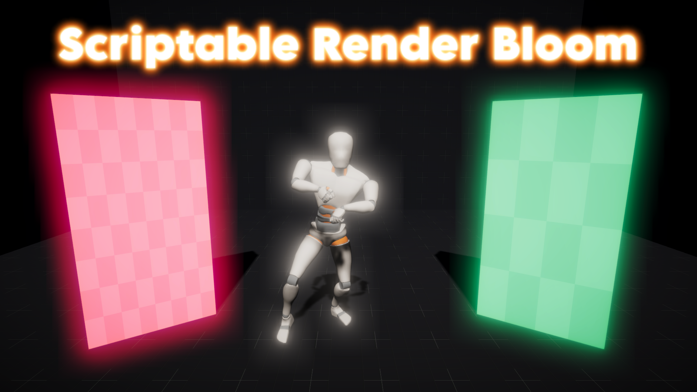
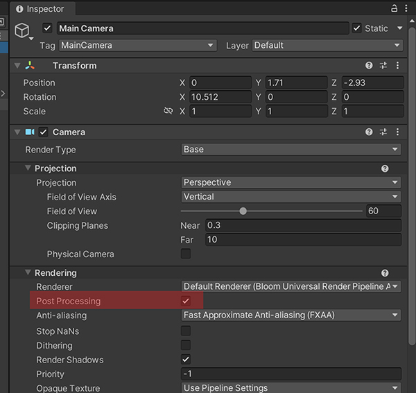

<p align="center"></p>

<p align="center"><b>Bloom effect compatible with ScriptableRenderPass</b></p>

[Unity's URP Bloom](https://docs.unity3d.com/Packages/com.unity.render-pipelines.universal@12.1/manual/post-processing-bloom.html) effect is not compatible with other [ScriptableRendererFeature](https://docs.unity3d.com/Packages/com.unity.render-pipelines.universal@12.1/manual/renderer-features/scriptable-renderer-features/inject-a-pass-using-a-scriptable-renderer-feature.html?q=ScriptableRendererFeature) based effects. If you use [one of my assets](https://assetstore.unity.com/publishers/62716) and you want to add Bloom to it, you can use this version which is compatible.

## 🎇 Features

* Compatible with other postprocess effects based on [ScriptableRendererFeature](https://docs.unity3d.com/Packages/com.unity.render-pipelines.universal@12.1/manual/renderer-features/scriptable-renderer-features/inject-a-pass-using-a-scriptable-renderer-feature.html?q=ScriptableRendererFeature).
* Fast Kawase blur.

## 🔧 Requisites

* Unity 2021.3 or higher.
* Universal RP 12.1.7 or higher.

## ⚙️ Installation

### Git

Just clone the repository into your Assets folder:

```c#
git clone https://github.com/FronkonGames/ScriptableRenderBloom.git
```

### Zip

Click on 'Code' and select 'Download ZIP'. Unzip it in the Assets directory.

## 🚀 Use

Once installed, you have to add ‘Scriptable Render Bloom’ as a ‘[Render Feature](https://docs.unity3d.com/Packages/com.unity.render-pipelines.universal@12.1/manual/urp-renderer-feature.html)’. This [official tutorial](https://docs.unity3d.com/Packages/com.unity.render-pipelines.universal@12.1/manual/urp-renderer-feature-how-to-add.html) tells how to do it.

<p align="center"></p>

Remember that the camera you are using must have the ‘Post Processing’ option enabled.

<p align="center"></p>

## 📜 Licenses

Code released under [MIT License](https://github.com/FronkonGames/ScriptableRenderBloom/blob/main/LICENSE.md).

'[Mannequin](https://assethunts.itch.io/mannequinfree)' by [AssetHunts](https://assethunts.itch.io/).

'GangnamStyle' animation by [Mixamo](https://mixamo.com/).